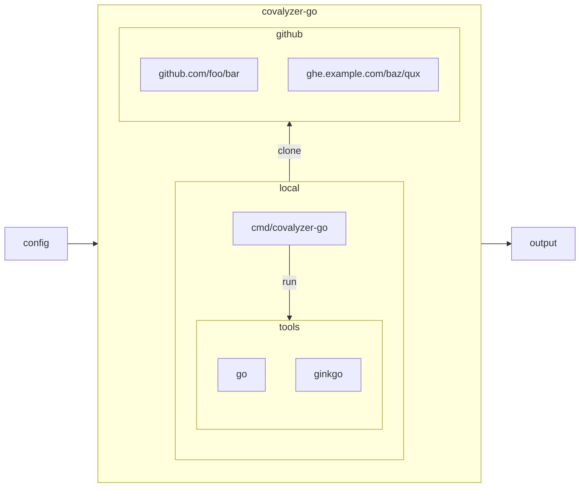
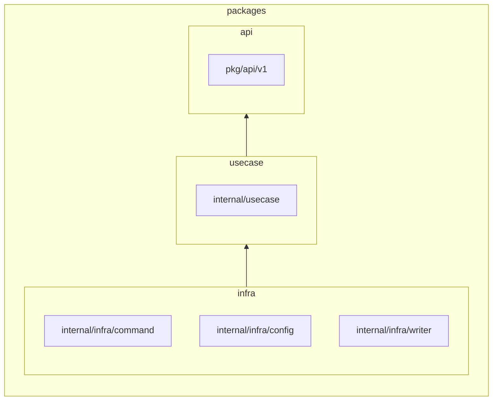

# covalyzer-go
covalyzer-go is a tool for aggregating and analyzing code coverage reports in golang

[](https://github.com/nokamoto/covalyzer-go/actions/workflows/ci.yaml)
[](https://codecov.io/gh/nokamoto/covalyzer-go)

## Getting started

### Prerequisites
- go
- ginkgo (if specified `ginkgo_packages`)

### Example config.yaml

```yaml
repositories:
- owner: nokamoto
  repo: covalyzer-go
  ginkgo_packages:
  - cmd/covalyzer-go-test
timestamps:
- "2024-02-01T00:00:00Z"
- "2024-03-01T00:00:00Z"
```

Aggregate and analyze code coverage report for the nokamoto/covalyer-go repository by running `go run ./cmd/covlayzer-go`.

It will output the following summaries:
- [go tool cover](./examples/covalyzer.csv) 
- [ginkgo outline](./examples/covalyzer-ginkgo-outline.csv)
- [ginkgo run --json-report](./examples/covalyzer-ginkgo-report.csv)

For more details, see following proto files:
- [config](./api/v1/config.proto)
- [output](./api/v1/covalyzer.proto)

## Design


### Go packages layout


